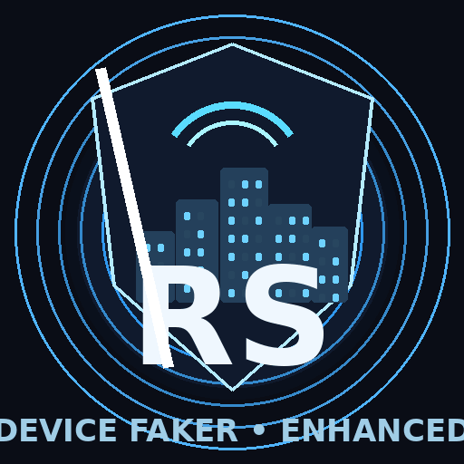

<div align="center">

# Device Faker — Enhanced Edition



### A modern, enhanced, independently modified edition of Device Faker

<p>
  <a href="https://github.com/salman-dev-app"></a>
  <a href="https://github.com/salman-dev-app"></a>
  <a href="https://t.me/salmandevapp"></a>
  <a href="https://facebook.com/salmandevapp"></a>
</p>

<p>
  <a href="mailto:mdsalmanhelp@gmail.com"></a>
  <a href="https://wa.me/8801840933137"></a>
</p>

</div>

---

## ◈ About

**Device Faker — Enhanced Edition** is an independently modified and enhanced version based on the original **Device Faker** project.

The original project provides the core foundation for application-specific device model spoofing. This edition builds on that foundation with additional development work focused on features, compatibility, configuration, usability, and broader Android environment support.

> **Original repository:** [Seyud/Device_Faker](https://github.com/Seyud/Device_Faker)

---

## ◈ What's Different

<table>
<tr>
<td width="50%">

### Core Improvements

- Improved device profile handling
- Extended configuration capabilities
- Per-application customization
- Runtime and stability improvements
- Better configuration validation
- Additional user-facing functionality

</td>
<td width="50%">

### Compatibility Focus

- Broader Android environment support
- Reduced dependence on a single workflow
- Improved portability
- Better handling across different device configurations
- Compatibility-oriented runtime changes

</td>
</tr>
</table>

---

## ◈ Feature Set

| Feature | Enhanced Edition |
|---|:---:|
| Per-application device profiles | ✓ |
| Multiple device templates | ✓ |
| Custom device configuration | ✓ |
| Application-specific configuration | ✓ |
| WebUI management | ✓ |
| TOML configuration | ✓ |
| Runtime configuration workflow | ✓ |
| CPU / system information handling | ✓ |
| Compatibility improvements | ✓ |
| Stability & error-handling improvements | ✓ |
| Expanded Android environment support | ✓ |

---

## ◈ Device Profiles

Configure different device identities for different applications without forcing a single profile across everything.

```text
┌─────────────────────┐
│     Application A   │
└──────────┬──────────┘
           ↓
     Device Profile A

┌─────────────────────┐
│     Application B   │
└──────────┬──────────┘
           ↓
     Device Profile B

┌─────────────────────┐
│     Application C   │
└──────────┬──────────┘
           ↓
     Device Profile C
```

This keeps configuration flexible and application-specific.

---

## ◈ Enhanced WebUI

A cleaner management layer makes it easier to work with:

- Device templates
- Application configuration
- Custom profiles
- Template assignment
- Configuration status
- Device information
- Multilingual settings

---

## ◈ Compatibility

A major focus of this modification is **broader compatibility**.

The project has been developed with different Android devices, ROMs, kernels, root implementations, and modification environments in mind.

The goal is to reduce unnecessary environment-specific limitations and provide a more adaptable experience.

> Compatibility can still vary depending on the Android version, ROM, kernel, root implementation, security mechanisms, installed modules, and application behavior.

---

## ◈ Beyond a Magisk-Focused Workflow

The original project was built around a Zygisk/Magisk-oriented architecture.

This enhanced edition is developed with a broader compatibility direction, aiming to make the project more adaptable to different Android modification environments rather than depending entirely on one workflow.

---

## ◈ Configuration

Configuration remains simple and transparent.

```text
/data/adb/device_faker/config/config.toml
```

After changing supported configuration values, restart the affected application to apply the changes.

For detailed configuration information:

**[Configuration Documentation](CONFIG.md)**

---

## ◈ What I Modified

This edition contains development work across:

- Core functionality
- Device profile management
- Application-specific configuration
- Compatibility
- Configuration handling
- WebUI
- Runtime behavior
- Stability
- Error handling
- Performance and usability
- Documentation
- Broader Android environment support

The project will continue to evolve as additional improvements are developed.

---

# ◈ Developer

<div align="center">

## Md Salman Biswas

**Web Developer · Developer & Maintainer of this Enhanced Edition**

<p>
  <a href="https://github.com/salman-dev-app">GitHub</a> ·
  <a href="https://t.me/salmandevapp">Telegram</a> ·
  <a href="https://facebook.com/salmandevapp">Facebook</a>
</p>

<p>
  <a href="mailto:mdsalmanhelp@gmail.com">mdsalmanhelp@gmail.com</a> ·
  <a href="https://wa.me/8801840933137">WhatsApp</a>
</p>

</div>

### Developer Statement

I independently modified and extended the original project by adding new functionality, improving compatibility, enhancing usability, and working toward broader Android environment support.

---

## ◈ Credits

This project is based on the original work of **Seyud** and the contributors to **Device Faker**.

**Original repository:**  
https://github.com/Seyud/Device_Faker

The original project also references:

- `zygisk-dump-dex`
- `zygisk-api-rs`
- `MiPushZygisk`

All original authors retain credit for their respective work.

---

## ◈ Disclaimer

This project is provided for research, development, testing, customization, and educational purposes.

Compatibility may vary between devices and Android environments. No claim is made that every application or device will behave identically in every configuration.

Users are responsible for how they use this project.

---

<div align="center">

## Support the Project

If you find this project useful:

**Star it · Test it · Report issues · Suggest improvements**

<br>

**Device Faker — Enhanced Edition**

<sub>More control · Broader compatibility · A cleaner experience</sub>

<br><br>

**© 2026 Md Salman Biswas**

</div>
